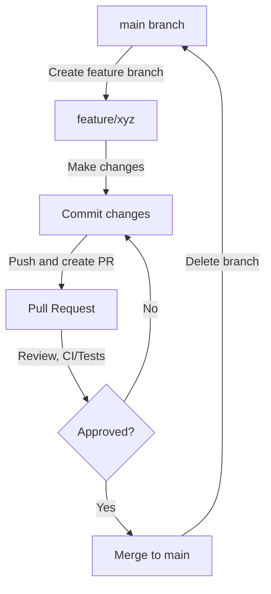

# GitHub Flow Branching Strategy

## Overview

OTG-MCP follows the GitHub Flow branching strategy - a lightweight, branch-based workflow that supports teams and projects where deployments are made regularly.

## Our Branching Strategy

We maintain a simple branching model:

1. **Main branch (`main`)**: 
   - Always deployable
   - Protected branch that requires pull request reviews
   - CI/CD automatically runs tests on all changes
   - Source of all deployments

2. **Feature branches**:
   - Created from `main`
   - Named descriptively (e.g., `feature/add-traffic-metrics`, `fix/connection-timeout`)
   - Used for new features, fixes, or any changes
   - Merged back to `main` via pull requests
   - Deleted after merge

## Workflow



### Development Process

1. **Create a feature branch from `main`**
   ```bash
   git checkout main
   git pull origin main
   git checkout -b feature/your-feature-name
   ```

2. **Make changes and commit**
   ```bash
   # Make changes
   git add .
   git commit -m "Descriptive commit message"
   ```

3. **Push changes and create a Pull Request**
   ```bash
   git push -u origin feature/your-feature-name
   # Create PR via GitHub interface
   ```

4. **Review Process**
   - CI automatically runs tests
   - Code review by teammates
   - Address feedback and make changes if needed

5. **Merge and Clean Up**
   - Merge the approved PR to `main`
   - Delete the feature branch
   - CI/CD deploys the changes automatically

## Benefits of GitHub Flow

- **Simplicity**: Easy to understand and follow
- **Continuous Delivery**: Main branch is always deployable
- **Fast Feedback**: Quick review cycles and automated testing
- **Reduced Overhead**: No need to manage multiple long-lived branches
- **Focus on Features**: Each branch represents a discrete piece of work

## Additional Best Practices

- Keep feature branches short-lived (days, not weeks)
- Commit frequently with clear messages
- Pull from `main` regularly to reduce merge conflicts
- Write tests for new features before merging
- Document significant changes

GitHub Flow is particularly well-suited for our project as we focus on continuous integration, regular deployments, and maintaining a single production version.
